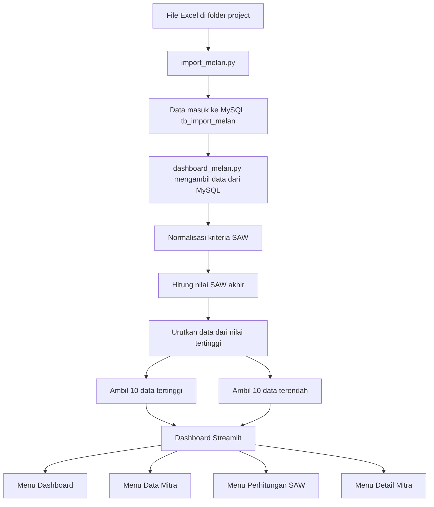

# Dashboard Sistem Pendukung Keputusan SAW UMKM

Aplikasi ini adalah dashboard **Streamlit** untuk menampilkan hasil analisis **Simple Additive Weighting (SAW)** pada data UMKM yang disimpan di **MySQL**. Dashboard ini difokuskan sebagai **Sistem Pendukung Keputusan (SPK)**: ringkas, jelas, dan siap dipresentasikan.

Data yang ditampilkan bukan data mentah, melainkan data yang sudah dihitung normalisasinya, diberi bobot, lalu difilter menjadi **20 data**: **10 nilai SAW tertinggi** dan **10 nilai SAW terendah**.

## Diagram Alur Kerja Dashboard

Berikut alur kerja dashboard dari data mentah sampai tampil di halaman Streamlit:



Intinya, dashboard tidak menampilkan semua data mentah. Yang ditampilkan adalah hasil perhitungan SAW yang sudah difilter menjadi 20 data, yaitu 10 teratas dan 10 terbawah.

## Struktur Menu

Dashboard hanya memakai 4 menu utama:

- Dashboard
- Data Mitra
- Perhitungan SAW
- Detail Mitra

## Kriteria SAW

| Kode | Kriteria | Jenis | Bobot |
|---|---|---|---|
| C1 | Jumlah Realisasi | Benefit | 0.40 |
| C2 | Outstanding | Cost | 0.30 |
| C3 | Kolektabilitas BUMN | Benefit | 0.20 |
| C4 | Accrued Interest | Cost | 0.10 |

## Rumus SAW

### Benefit

Digunakan untuk C1 dan C3.

```text
rij = xij / max(xj)
```

### Cost

Digunakan untuk C2 dan C4.

```text
rij = min(xj) / xij
```

### Nilai Akhir

```text
Vi = (C1 × 0.40) + (C2 × 0.30) + (C3 × 0.20) + (C4 × 0.10)
```

Semakin besar nilai SAW, semakin baik hasilnya.

## Tampilan Dashboard

### 1. Header Dashboard

Menampilkan identitas dashboard dan bobot SAW.

### 2. KPI / Summary Cards

Empat sampai lima kartu ringkasan yang dapat ditampilkan:

- Jumlah data ditampilkan
- Total jumlah realisasi
- Total outstanding
- Rata-rata nilai SAW
- Nilai SAW tertinggi

### 3. Grafik Utama

Dashboard menampilkan 4 grafik utama:

- Top 10 Nilai SAW
- Bottom 10 Nilai SAW
- Komposisi Kolektabilitas
- Scatter Plot Realisasi vs Outstanding

### 4. Data Mitra

Menampilkan 20 data hasil filter SAW dengan kolom:

- Nama Mitra
- Jumlah Realisasi
- Outstanding
- Kolektabilitas
- Accrued Interest
- Nilai SAW

Catatan: tidak ada ranking dan tidak ada status prioritas pada tampilan tabel.

### 5. Perhitungan SAW

Menampilkan proses perhitungan untuk satu mitra:

- Nilai awal tiap kriteria
- Hasil normalisasi
- Bobot
- Nilai terbobot
- Nilai SAW akhir

### 6. Detail Mitra

Menampilkan ringkasan lengkap satu mitra:

- Nilai SAW
- Kolektabilitas
- Skor kolektabilitas
- Jumlah realisasi
- Outstanding
- Accrued interest
- Tabel normalisasi SAW

### 7. Download

Tersedia tombol download CSV pada halaman data, perhitungan, dan detail mitra.

## Warna UI

Tema yang digunakan dibuat sederhana dan modern:

- Putih
- Biru tua
- Abu-abu
- Hijau lembut untuk aksen sukses

## File Penting

```text
projectMelan/
├── dashboard_melan.py
├── import_melan.py
├── README.md
└── data melan ini yang bener .xlsx
```

## Persiapan Database

Pastikan XAMPP sudah berjalan dan MySQL aktif.

Buat database:

```sql
CREATE DATABASE IF NOT EXISTS db_melan;
USE db_melan;
```

Pastikan tabel `tb_import_melan` tersedia.

## Install Library

Jalankan di terminal pada folder project:

```bash
pip install streamlit pandas numpy pymysql plotly openpyxl
```

## Import Data Excel

File Excel sudah berada di folder project. Untuk memasukkan data ke MySQL, jalankan:

```bash
python import_melan.py
```

Script akan membaca file Excel di folder project dan mengisi tabel `tb_import_melan`.

## Menjalankan Dashboard

```bash
streamlit run dashboard_melan.py
```

Biasanya Streamlit akan terbuka di:

```text
http://localhost:8501
```

## Catatan Penting

- Dashboard membaca data dari MySQL, bukan langsung dari Excel.
- Jika file Excel berubah, jalankan ulang `import_melan.py`.
- Dashboard hanya menampilkan data hasil filter SAW, bukan semua data mentah.
- Ranking dan status prioritas tidak ditampilkan pada tabel utama.

## Kesimpulan

Dashboard ini membantu menampilkan hasil analisis SAW dengan tampilan yang lebih sederhana, modern, dan cocok untuk presentasi atau sidang. Fokus utama dashboard adalah memperlihatkan hasil perhitungan, grafik, data mitra, dan detail SAW secara jelas.